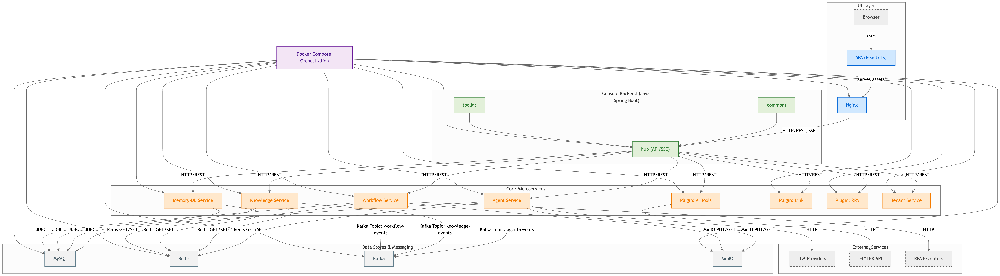

# Astron Agent 项目模块说明

## 项目概述

**Astron Agent** 是一个企业级、商业友好的 Agentic Workflow 开发平台，整合了 AI 工作流编排、模型管理、AI 与 MCP 工具、RPA 自动化和团队协作功能。

## 项目架构图



---

## 模块列表

### 用户界面层（UI Layer）

#### 1. Console Frontend（控制台前端）

**模块路径**：`console/frontend/`

**使用语言**：TypeScript + React

**主要职责**：
- 提供 Web 用户界面（SPA 单页应用）
- Agent 创建和配置界面
- 工作流可视化编辑器
- 知识库管理界面
- 模型管理和配置
- 实时聊天窗口
- 多租户空间管理

**技术栈**：React 18、TypeScript 5、Vite 5、Ant Design 5、Tailwind CSS、ReactFlow、Recoil/Zustand

---

### 控制台后端层（Console Backend）

#### 2. Console Backend（控制台后端）

**模块路径**：`console/backend/`

**使用语言**：Java

**主要职责**：
- 提供管理控制台的 REST API 和 SSE 接口
- 用户认证和权限管理
- Agent、Workflow、Knowledge 的 CRUD 接口
- 模型管理和配置接口
- 文件上传下载服务
- 数据统计和分析

**技术栈**：Spring Boot 3.5.4、MyBatis Plus 3.5.7、Spring Security、OAuth2

**子模块**：
- **hub**：主 API 服务模块
- **toolkit**：工具模块
- **commons**：公共模块（DTO、工具类等）

---

### 核心微服务层（Core Microservices）

#### 3. Agent Service（智能体服务）

**模块路径**：`core/agent/`

**使用语言**：Python

**主要职责**：
- Agent 核心执行引擎
- 支持多种 Agent 类型（Chat Agent、CoT Agent、CoT Process Agent）
- Agent 生命周期管理
- 工具调用和插件集成
- 会话管理和上下文持久化

**技术栈**：FastAPI、SQLAlchemy 2.0、Pydantic、OpenTelemetry

**架构设计**：遵循 DDD（领域驱动设计），包含 API 层、服务层、领域层、仓储层

---

#### 4. Workflow Service（工作流服务）

**模块路径**：`core/workflow/`

**使用语言**：Python

**主要职责**：
- 工作流编排和执行引擎（Spark Flow）
- 多步骤流程自动化
- 工作流版本管理
- 事件驱动的异步处理
- 工作流可视化运行时调试

**技术栈**：FastAPI、SQLModel、SQLAlchemy 2.0、Kafka（事件流）、LangChain

**事件机制**：通过 Kafka Topic `workflow-events` 进行事件通信

---

#### 5. Knowledge Service（知识库服务）

**模块路径**：`core/knowledge/`

**使用语言**：Python

**主要职责**：
- 知识库管理和文档处理
- 文档向量化和语义搜索
- RAG（检索增强生成）实现
- LLM 集成和 embeddings 生成
- 支持多种文档格式解析

**技术栈**：FastAPI、RAGFlow SDK、OpenAI API、SQLModel、Redis

**事件机制**：通过 Kafka Topic `knowledge-events` 进行事件通信

---

#### 6. Memory DB Service（内存数据库服务）

**模块路径**：`core/memory/`

**使用语言**：Python

**主要职责**：
- 对话历史存储和检索
- 上下文管理（长期记忆和短期记忆）
- 会话数据持久化

**技术栈**：Python、数据库抽象层

---

#### 7. Tenant Service（租户服务）

**模块路径**：`core/tenant/`

**使用语言**：Go

**主要职责**：
- 多租户管理
- 空间隔离和权限控制
- 组织结构管理
- 资源配额管理

**技术栈**：Go 1.23、Gin 框架、MySQL

**设计理念**：采用 Go 实现以保证高性能和低内存开销

---

### 插件系统（Plugin System）

#### 8. Plugin: AI Tools（AI 工具插件）

**模块路径**：`core/plugin/aitools/`

**使用语言**：Python

**主要职责**：
- 集成讯飞 AI 工具（IFLYTEX API）
- 第三方 AI 工具集成
- 工具调用管理和结果缓存

**技术栈**：FastAPI、HTTP Client

---

#### 9. Plugin: RPA（RPA 插件）

**模块路径**：`core/plugin/rpa/`

**使用语言**：Python

**主要职责**：
- RPA 流程自动化
- 流程录制和回放
- 自动化脚本执行
- 与外部 RPA 执行器集成

**技术栈**：FastAPI、RPA SDK

---

#### 10. Plugin: Link（链接插件）

**模块路径**：`core/plugin/link/`

**使用语言**：Python

**主要职责**：
- 外部链接资源集成
- URL 内容抓取和处理
- 链接验证和元数据提取

**技术栈**：FastAPI、HTTP Client

---

### 公共服务层（Common Services）

#### 11. Common Module（公共模块）

**模块路径**：`core/common/`

**使用语言**：Python

**主要职责**：
- 提供跨项目的公共服务和工具
- 认证和审计系统（MetrologyAuth）
- 可观测性支持（OTLP、OpenTelemetry）
- 数据库、缓存、消息队列连接管理
- 统一日志系统
- OSS（MinIO）对象存储集成

**技术栈**：Python、SQLModel、Redis Client、Kafka Client、OpenTelemetry

**核心价值**：为所有 Python 微服务提供统一的基础设施抽象

---

## 基础设施组件（Data Mgmt & Messaging）

### 数据持久化
- **MySQL**：主数据库，存储结构化数据
- **Redis**：缓存服务，会话存储、事件注册表
- **PostgreSQL**：可选的辅助数据库

### 消息队列
- **Kafka**：事件流处理和服务间通信
  - Topic: `workflow-events` - 工作流事件
  - Topic: `knowledge-events` - 知识库事件
  - Topic: `agent-events` - Agent 事件

### 对象存储
- **MinIO**：文件存储服务（PUT/GET 操作）

---

## 外部服务集成（External Services）

### LLM 提供商（LLM Providers）
- 集成多种大语言模型服务（OpenAI、Azure OpenAI、本地模型等）
- 提供统一的 LLM 调用接口

### IFLYTEX API
- 讯飞 AI 工具 API 集成
- 通过 AI Tools 插件调用

### RPA Executors（RPA 执行器）
- 外部 RPA 自动化执行器
- 通过 RPA 插件进行任务分发和执行

---

## 模块依赖关系

### 按层级划分

```
UI Layer（用户界面层）
    └── Console Frontend (React/TS)
         ↓ HTTP/REST/SSE

Console Backend（控制台后端层）
    └── Console Backend (Java Spring Boot)
         ↓ HTTP/REST

Core Microservices（核心微服务层）
    ├── Agent Service (Python FastAPI)
    ├── Workflow Service (Python FastAPI)
    ├── Knowledge Service (Python FastAPI)
    ├── Memory DB Service (Python)
    ├── Tenant Service (Go Gin)
    ├── Plugin: AI Tools (Python FastAPI)
    ├── Plugin: Link (Python FastAPI)
    └── Plugin: RPA (Python FastAPI)
         ↓

Common Services（公共服务层）
    └── Common Module (Python)
         ↓

Data & Messaging（数据和消息层）
    ├── MySQL (关系数据库)
    ├── Redis (缓存/会话)
    ├── Kafka (事件流)
    └── MinIO (对象存储)
         ↓

External Services（外部服务）
    ├── LLM Providers (大语言模型)
    ├── IFLYTEX API (讯飞 API)
    └── RPA Executors (RPA 执行器)
```

### 服务通信方式

| 通信路径 | 协议 | 说明 |
|---------|------|------|
| Frontend → Backend | HTTP/REST, SSE | REST API 调用和服务端推送事件 |
| Backend → Core Services | HTTP/REST | RESTful API 调用 |
| Core Services ↔ Core Services | Kafka Topics | 异步事件驱动通信 |
| Core Services → MySQL | JDBC/SQLAlchemy | 数据持久化 |
| Core Services → Redis | Redis Protocol | 缓存读写、会话管理 |
| Core Services → Kafka | Kafka Protocol | 发布/订阅事件 |
| Core Services → MinIO | MinIO API (PUT/GET) | 文件上传下载 |
| Plugins → External Services | HTTP/gRPC | 外部 API 调用 |

---

## 模块间依赖矩阵

| 模块 | 依赖的模块 | 被依赖的模块 |
|------|-----------|-------------|
| **Console Frontend** | Console Backend | - |
| **Console Backend** | Agent, Workflow, Knowledge, Tenant | Console Frontend |
| **Agent Service** | Common, Plugin (AI Tools/Link/RPA), Memory | Workflow, Console Backend |
| **Workflow Service** | Common, Agent, Plugin | Console Backend |
| **Knowledge Service** | Common, LLM Providers | Agent, Workflow, Console Backend |
| **Memory DB Service** | Common | Agent |
| **Tenant Service** | MySQL | 所有服务（租户上下文） |
| **Plugin: AI Tools** | Common, IFLYTEX API | Agent, Workflow |
| **Plugin: RPA** | Common, RPA Executors | Agent, Workflow |
| **Plugin: Link** | Common | Agent, Workflow |
| **Common Module** | MySQL, Redis, Kafka, MinIO | 所有 Python 服务 |

---

## 技术栈汇总

| 层级 | 模块 | 语言/框架 | 版本 |
|------|------|----------|------|
| **前端** | Console Frontend | TypeScript + React | TS 5.9.2, React 18.2.0 |
| **后端** | Console Backend | Java + Spring Boot | Java 21, Spring Boot 3.5.4 |
| **微服务** | Agent Service | Python + FastAPI | Python 3.11+, FastAPI 0.115+ |
| | Workflow Service | Python + FastAPI | Python 3.11+, FastAPI 0.115+ |
| | Knowledge Service | Python + FastAPI | Python 3.11+, FastAPI 0.115+ |
| | Memory DB Service | Python | Python 3.11+ |
| | Tenant Service | Go + Gin | Go 1.23, Gin 1.10.1 |
| **插件** | AI Tools Plugin | Python + FastAPI | Python 3.11+, FastAPI 0.115+ |
| | RPA Plugin | Python + FastAPI | Python 3.11+, FastAPI 0.115+ |
| | Link Plugin | Python + FastAPI | Python 3.11+, FastAPI 0.115+ |
| **公共** | Common Module | Python | Python 3.11+ |
| **数据** | MySQL | 关系数据库 | MySQL 5.7+ |
| | Redis | 缓存/内存数据库 | Redis 6.0+ |
| | Kafka | 消息队列 | Kafka 2.5.0+ |
| | MinIO | 对象存储 | MinIO 8.5.10 |

---

## 开发规范

### Python 模块
- **架构**：DDD（领域驱动设计）
- **代码风格**：Black + isort
- **类型检查**：MyPy
- **代码分析**：Pylint、Flake8
- **测试**：Pytest（覆盖率 ≥ 70%）

### Java 模块
- **架构**：Spring Boot 分层架构
- **代码风格**：Checkstyle
- **代码分析**：PMD
- **测试**：JUnit

### TypeScript 模块
- **代码风格**：ESLint + Prettier
- **类型检查**：TypeScript 严格模式
- **测试**：Jest + React Testing Library

### Go 模块
- **代码风格**：Go fmt
- **代码分析**：Go vet、Golint

---

## 相关文档

- [项目主页 README](../README-zh.md)
- [部署指南](./DEPLOYMENT_GUIDE_zh.md)
- [配置说明](./CONFIGURATION_zh.md)
- [Agent 开发指南](../core/agent/CLAUDE.md)
- [前端开发指南](../console/frontend/CLAUDE.md)

---

**文档版本**：v1.0
**最后更新**：2025-11-25
