# 功能与使用 FAQ

## 为什么一句话创建智能体失败？

提示词创建智能体时，如果点击立即创建，需要调用讯飞开放平台的模型能力，请先将AstronAgent与您的讯飞开放平台的应用进行绑定（参考部署文档），然后领取对应模型的额度即可。或者直接点击跳过，使用第三方模型进行会话。

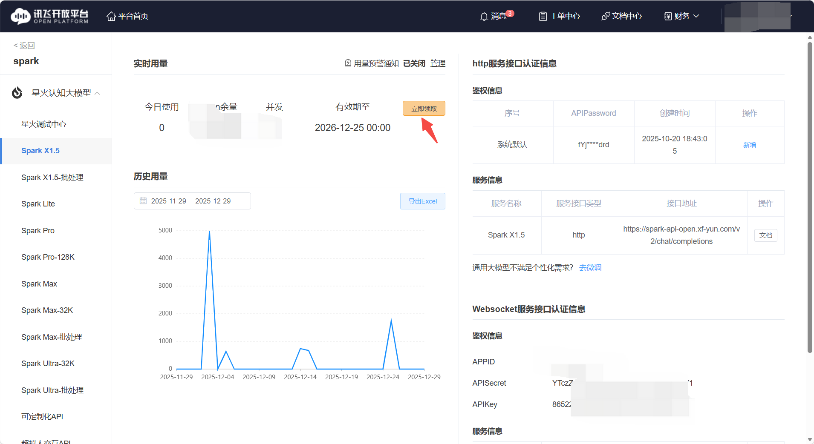
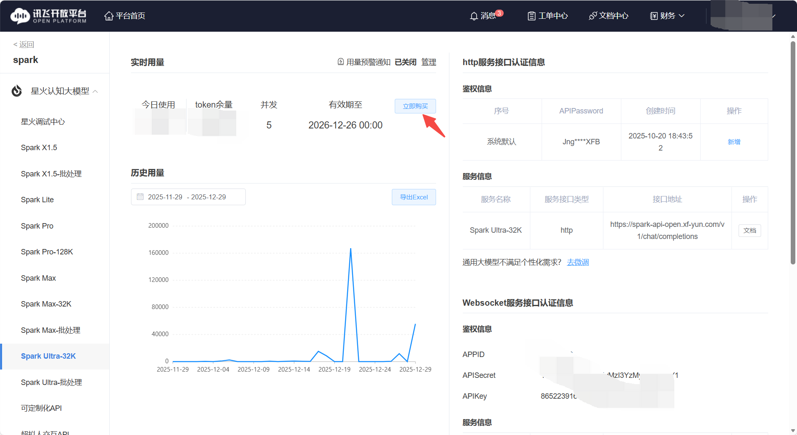

## 工作流创建失败或显示异常 (Unknown column)？

1. 原因: 数据库表结构版本落后。
2. 解决: 检查后端日志，若出现 Unknown column 'module_id'  或 type  等错误，需在数据
库执行相应的 ALTER TABLE  语句补全字段（如 alter table c_param add column
module_id varchar(50) DEFAULT NULL ）。

## 知识库 (Knowledge Base) 常见问题？

1. 文件上传失败:
- 检查 MinIO 服务是否正常，端口（如 18998/18999）是否开放。
- 检查 Agent 与 RAGFlow、MinIO 之间的网络连通性及环境变量配置。
2. RAGFlow 同步: 目前支持从 Agent 上传同步至 RAGFlow；直接在 RAGFlow 上传的文件需在 Agent 端进行关联操作才能使用。
3. Rerank 模型: 星火知识库默认启用 Rerank。

## 怎么使用虚拟人？

在AstronAgent中使用虚拟人技术需要在讯飞虚拟人官网中申请对应的服务并配置到环境变量中：
1. 打开讯飞虚拟人官网https://virtual-man.xfyun.cn/，进入应用控制台

2. 点击左侧边栏中的接口服务
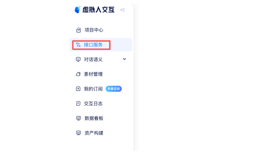
3. 点击右侧详情的免费开通
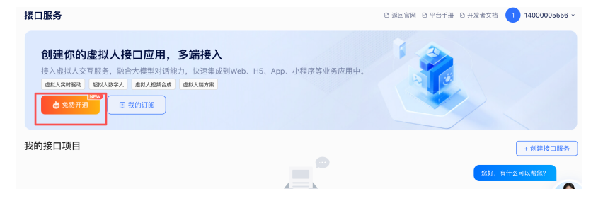
4. 按照自身信息填写表单并进行提交
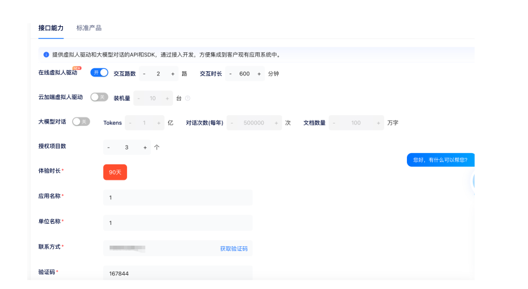
5. 提交成功后，自动跳转页面，若后续进入，可直接点击左侧我的订阅栏目
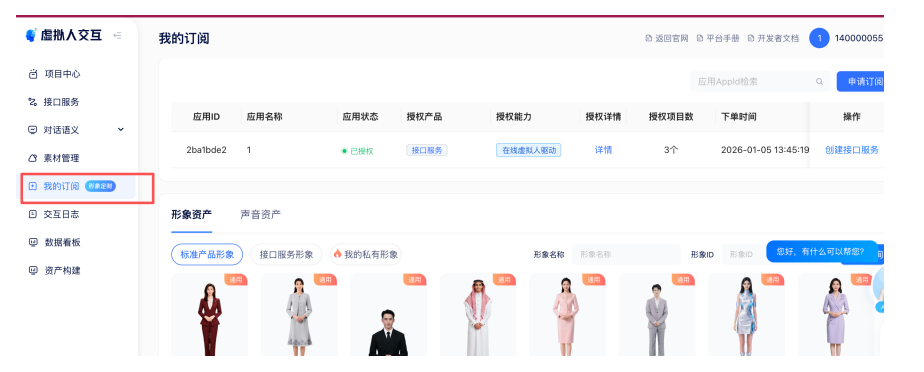
6. 点击创建接口服务
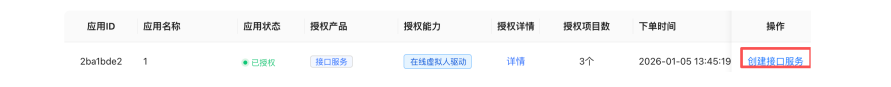
7. 点击右上角创建接口服务，填写表单
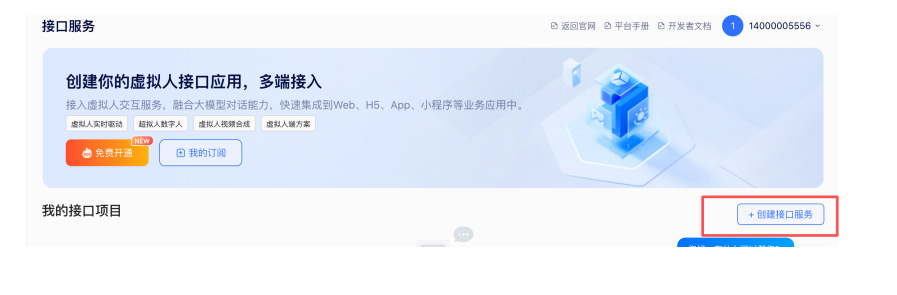
8. 获取应用三元信息，并点击发布按钮
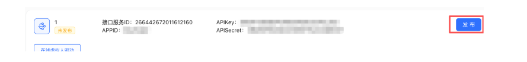
9. 将应用三元信息填入对应.env对应配置项内，启动/重启docker compose服务即可使用


⚠️特别注意因虚拟人需要用到浏览器的媒体捕获 API navigator.mediaDevices，所以需要https或者localhost这种安全环境，若您没有这样的环境，chrome浏览器可以设置绕过检查，具体设置如下：
1. 打开 chrome://flags/#unsafely-treat-insecure-origin-as-secure
2. 搜索 Insecure origins treated as secure，找到此项，并设置为：已启用（否则无法无效）
3. 在输入框填写您的地址，如：http://172.29.192.11，如果有多个，请用英文逗号分隔即可
4. 保存重启浏览器，即可生效

## 变量如何使用？

1. 引用方式: 在节点输入框中使用 {{变量名}}  引用上游节点输出或全局变量。
2. 迭代节点: 在迭代节点内部，使用当前迭代项变量（如 item ）进行处理。

## 如何自定义原子组件？

目前需要修改代码并手动更新数据库中的原子树信息。后续版本将提供更便捷的自定义组件开发方式。

## 支持自定义 MCP (Model Context Protocol) 工具吗？

支持。可以在 Web 端的工作流节点（如 Agent 智能决策节点）中添加和配置 MCP 工具。

## 知识库（RAG）引用有问题，无法检索或回答？

1. 早期版本的对话型 Agent 在引用知识库时可能存在 Bug，建议更新到最新版本的镜像。
2. 工作流模式下引用知识库通常更稳定。

## 知识库 (RAG) 如何防止模型幻觉？

1. 检索到的知识库内容会作为上下文填充到 Prompt 中发送给模型。

2. 可以通过修改提示词（Prompt）来约束模型：例如添加“请仅依据检索到的内容回答，如果检索
内容中没有答案，请直接回复不知道，不要编造”。

## 已发布的应用如何删除或下架？

- 目前版本（开源版）可能在界面上未直接提供“下架”按钮。
- 通常需要在“我的智能体”卡片中查找删除选项。
- 如果找不到下架/删除入口，可能是当前版本的已知问题（Issue），建议关注 GitHub 仓库的修复
进度。

## 怎么使用https协议访问项目？

1. 修改配置文件，如图所示，添加https暴露接口，并修改CONSOLE_DOMAIN环境变量。
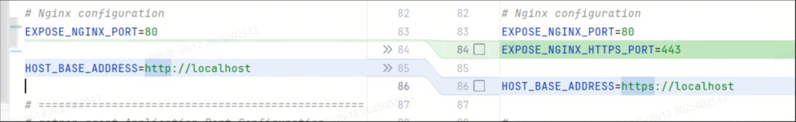
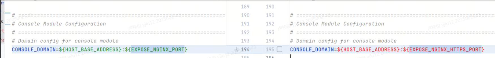
2. 修改docker-compose.yaml文件中nginx容器的配置，暴露出https和casdoor的端口号，并映射https证书文件。
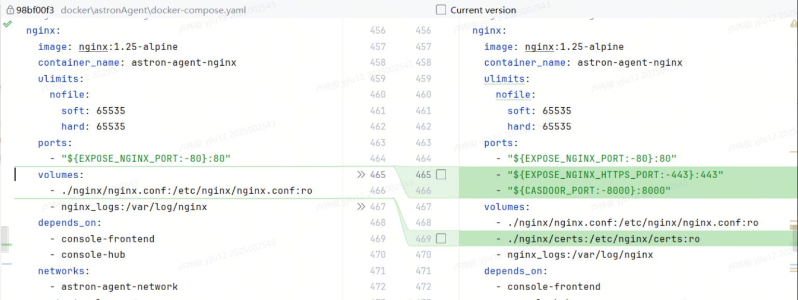
3. 修改docker/astronAgent/nginx/nginx.conf配置文件以适配https协议
```
worker_processes auto;
worker_rlimit_nofile 65535;

events {
    worker_connections 65535;
    multi_accept on;
}

http {
    include       /etc/nginx/mime.types;
    default_type  application/octet-stream;

    # Log format
    log_format main '$remote_addr - $remote_user [$time_local] "$request" '
                    '$status $body_bytes_sent "$http_referer" '
                    '"$http_user_agent" "$http_x_forwarded_for"';

    # Access log
    access_log /var/log/nginx/access.log main;
    error_log /var/log/nginx/error.log warn;

    # Basic configuration
    sendfile on;
    tcp_nopush on;
    tcp_nodelay on;
    keepalive_timeout 65;
    types_hash_max_size 2048;

    # Upload size limit
    client_max_body_size 20m;

    # Gzip compression
    gzip on;
    gzip_vary on;
    gzip_min_length 1000;
    gzip_types
        text/plain
        text/css
        text/xml
        text/javascript
        application/xml+rss
        application/javascript
        application/json;

    server {
        listen 80;
        server_name localhost;

        # Security headers
        add_header X-Frame-Options "SAMEORIGIN" always;
        add_header X-XSS-Protection "1; mode=block" always;
        add_header X-Content-Type-Options "nosniff" always;

        # Health check
        location /nginx-health {
            access_log off;
            return 200 "nginx is healthy\n";
            add_header Content-Type text/plain;
        }

        # Redirect all other HTTP traffic to HTTPS
        location / {
            return 301 https://$host$request_uri;
        }
    }

    server {
        listen 443 ssl http2;
        server_name localhost;

        ssl_certificate     /etc/nginx/certs/localhost.pem;
        ssl_certificate_key /etc/nginx/certs/localhost-key.pem;
        ssl_protocols       TLSv1.2 TLSv1.3;

        # Security headers
        add_header X-Frame-Options "SAMEORIGIN" always;
        add_header X-XSS-Protection "1; mode=block" always;
        add_header X-Content-Type-Options "nosniff" always;

        # Runtime config - no cache (dynamic config file)
        location = /runtime-config.js {
            proxy_pass http://console-frontend:1881;
            proxy_set_header Host $host;
            proxy_set_header X-Real-IP $remote_addr;
            proxy_set_header X-Forwarded-For $proxy_add_x_forwarded_for;
            proxy_set_header X-Forwarded-Proto https;

            # Disable caching for runtime config
            expires -1;
            add_header Cache-Control "no-store, no-cache, must-revalidate, proxy-revalidate, max-age=0";
            add_header Pragma "no-cache";
        }

        # Static resource caching
        location ~* \.(js|css|png|jpg|jpeg|gif|ico|svg|woff|woff2|ttf|eot)$ {
            proxy_pass http://console-frontend:1881;
            proxy_set_header Host $host;
            proxy_set_header X-Real-IP $remote_addr;
            proxy_set_header X-Forwarded-For $proxy_add_x_forwarded_for;
            proxy_set_header X-Forwarded-Proto https;

            expires 1y;
            add_header Cache-Control "public, immutable";
        }

        # SSE (Server-Sent Events) API proxy for workflow chat completions
        location /workflow/v1/chat/completions {
            proxy_pass http://core-workflow:7880/workflow/v1/chat/completions;
            proxy_set_header Host $host;
            proxy_set_header X-Real-IP $remote_addr;
            proxy_set_header X-Forwarded-For $proxy_add_x_forwarded_for;
            proxy_set_header X-Forwarded-Proto https;

            # SSE specific settings
            proxy_buffering off;                    # Disable buffering for real-time data transmission
            proxy_cache off;                        # Disable caching
            proxy_set_header Connection '';         # SSE uses persistent connections
            proxy_http_version 1.1;                 # Use HTTP/1.1
            chunked_transfer_encoding on;           # Enable chunked transfer encoding

            # Prevent nginx from buffering responses
            proxy_set_header X-Accel-Buffering no;

            # Timeout settings - SSE requires long-lived connections
            proxy_connect_timeout 60s;
            proxy_send_timeout 1800s;                # 30 minutes send timeout
            proxy_read_timeout 1800s;                # 30 minutes read timeout

            # Set correct headers for SSE
            add_header Cache-Control 'no-cache';
            add_header X-Accel-Buffering 'no';
        }

        # SSE (Server-Sent Events) API proxy for chat messages
        location /console-api/chat-message/ {
            proxy_pass http://console-hub:8080/chat-message/;
            proxy_set_header Host $host;
            proxy_set_header X-Real-IP $remote_addr;
            proxy_set_header X-Forwarded-For $proxy_add_x_forwarded_for;
            proxy_set_header X-Forwarded-Proto https;

            # SSE specific settings
            proxy_buffering off;                    # Disable buffering for real-time data transmission
            proxy_cache off;                        # Disable caching
            proxy_set_header Connection '';         # SSE uses persistent connections
            proxy_http_version 1.1;                 # Use HTTP/1.1
            chunked_transfer_encoding on;           # Enable chunked transfer encoding

            # Prevent nginx from buffering responses
            proxy_set_header X-Accel-Buffering no;

            # Timeout settings - SSE requires long-lived connections
            proxy_connect_timeout 60s;
            proxy_send_timeout 1800s;                # 30 minutes send timeout
            proxy_read_timeout 1800s;                # 30 minutes read timeout

            # Set correct headers for SSE
            add_header Cache-Control 'no-cache';
            add_header X-Accel-Buffering 'no';
        }

        # Backend API proxy - proxy /console-api path to console-hub
        location /console-api/ {
            proxy_pass http://console-hub:8080/;
            proxy_set_header Host $host;
            proxy_set_header X-Real-IP $remote_addr;
            proxy_set_header X-Forwarded-For $proxy_add_x_forwarded_for;
            proxy_set_header X-Forwarded-Proto https;

            # Timeout settings
            proxy_connect_timeout 30s;
            proxy_send_timeout 30s;
            proxy_read_timeout 30s;
        }

        # Frontend application proxy - default proxy to console-frontend
        location / {
            proxy_pass http://console-frontend:1881;
            proxy_set_header Host $host;
            proxy_set_header X-Real-IP $remote_addr;
            proxy_set_header X-Forwarded-For $proxy_add_x_forwarded_for;
            proxy_set_header X-Forwarded-Proto https;

            # Timeout settings
            proxy_connect_timeout 30s;
            proxy_send_timeout 30s;
            proxy_read_timeout 30s;
        }

        # Health check
        location /nginx-health {
            access_log off;
            return 200 "nginx is healthy\n";
            add_header Content-Type text/plain;
        }
    }

    # Casdoor HTTPS endpoint (same cert, different port)
    server {
        listen 8000 ssl http2;
        server_name localhost;

        ssl_certificate     /etc/nginx/certs/localhost.pem;
        ssl_certificate_key /etc/nginx/certs/localhost-key.pem;
        ssl_protocols       TLSv1.2 TLSv1.3;

        # Security headers
        add_header X-Frame-Options "SAMEORIGIN" always;
        add_header X-XSS-Protection "1; mode=block" always;
        add_header X-Content-Type-Options "nosniff" always;

        location / {
            proxy_pass http://casdoor:8000;
            proxy_set_header Host $host;
            proxy_set_header X-Real-IP $remote_addr;
            proxy_set_header X-Forwarded-For $proxy_add_x_forwarded_for;
            proxy_set_header X-Forwarded-Proto https;
        }
    }
}
```