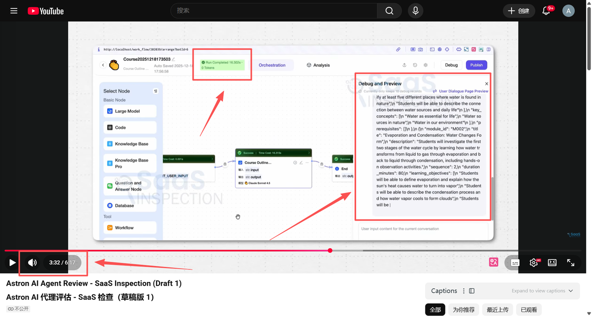
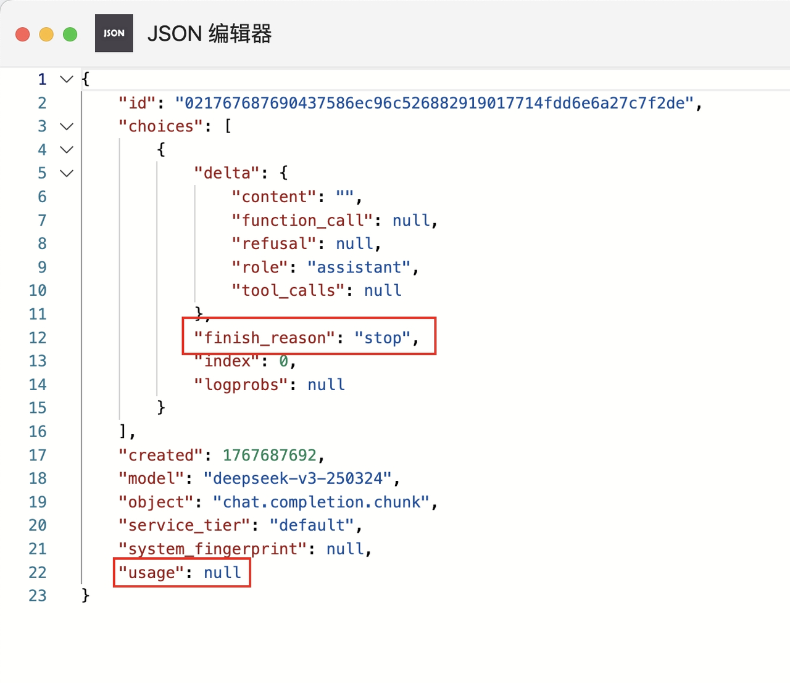

# 模型与AI功能 FAQ

## 模型下拉框为空，无法添加模型？

1. 平台配置: 在 Astron Console 的“模型管理”中添加模型。
2. 网络连通性: 确保容器能访问外部模型 API (如星火、DeepSeek、OpenAI)。

## 如何配置 DeepSeek 或其他 OpenAI 兼容模型？

1. 在“模型管理”中选择新建模型。
2. 接口地址: 填对应的 API 地址。
3. API 密钥: 填对应的 Key。

## 添加本地模型报错 IP 在黑名单？

默认配置可能禁止连接私有网段。
- 解决方法: 进入数据库，删除或清空 config_info  表中 category =
'NETWORK_SEGMENT_BLACK_LIST'  的记录。

## 显示“消耗 0 token”调试成功的情况？

通过open ai 的sdk调用，有的模型确实不返回token消耗，如下所示，usage为null。




## 如何配置本地服务（如本地部署的大模型）给 Agent 调用？

1. 网络互通：确保 Docker 容器内的服务能访问到宿主机或局域网内的服务。
- 不要使用 localhost  或 127.0.0.1 ，因为这会指向容器自身。
- 使用宿主机的局域网 IP（如 192.168.x.x ）或 Docker 的特殊 DNS
host.docker.internal （视 Docker 版本和系统而定）。

2. 黑名单限制：默认配置可能禁止连接私有网段（如 192.168.x.x ）。如果遇到拦截，需要修改
数据库表 config_info  (或 config_info_en ) 中的黑名单配置。

## 图片理解/OCR 插件报错？

1. 在 .env 中配置讯飞开放平台的 PLATFORM_APP_ID, PLATFORM_API_KEY, PLATFORM_API_SECRET。
2. 确保该 APPID 已在讯飞开放平台开通了对应的图像识别/OCR 能力权限。

## 如何获取和使用星火知识库资源？

若需要使用星火知识库，官方提供了创建星火知识库 并获取知识库数据集的工具：
1. 去讯飞开放平台开通知识库的能力：https://console.xfyun.cn/services/aidoc
2. 创建星火知识库，获取XINGHUO_DATASET_ID
3. 获取到数据集ID后，请将数据集ID更新到环境变量XINGHUO_DATASET_ID中
4. 使用 xinghuo_rag_tool 获取XINGHUO_DATASET_ID（需要浏览器打开 html）
```
# 从项目中打开
cd astron-agent/docs/
open xinghuo_rag_tool.html
# 下载 xinghuo_rag_tool -方式 1
wget https://raw.githubusercontent.com/iflytek/astron-agent/refs/heads/main/docs/xinghuo_rag_tool.html
# 直接从进入github下载 -方式 2
https://github.com/iflytek/astron-agent/blob/main/docs/xinghuo_rag_tool.html
```

